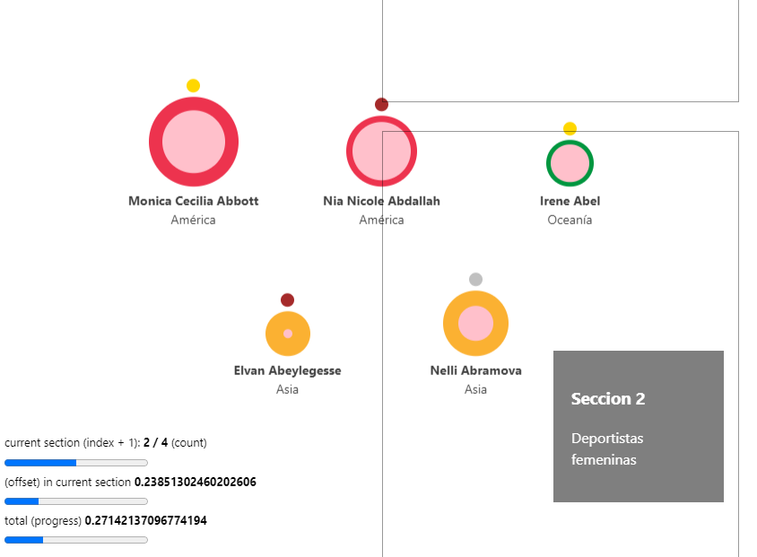

# VD | IA y Opinión Pública

### Narrativa visual de datos en formato de test o paseo interactivo basada en encuestas sobre diversos temas de inteligencia artificial y la opinión sobre ellos del público. Realizada para la materia Visualización de Datos por los alumnos Iván Mondrzak, Federico Peitti y Franco Setti.

---

### Referencias:

- [Stanford AI Index Report, la fuente de inspiración](https://aiindex.stanford.edu/report/)
- [Flourish: armado de gráficos de barras y mapas](https://flourish.studio/)
- [Radar animado: para los gráficos de torta](https://codepen.io/vii120/pen/yLGYqJq)
- Funciones y animaciones del flujo, como la escritura y la interactividad de elaboración propia con JavaScript

#TODO


---

## Motivación

Detrás del desarrollo de este trabajo, se buscaba comunicar los resultados de un estudio masivo realizado por la universidad de Stanford ([Starford AI Index Report 2023](https://aiindex.stanford.edu/report/)), el cual incluye métricas de todo tipo relacionadas con inteligencia artificial. En particular, se decidió trabajar con el capítulo 9 de dicho reporte, basado en opinión pública para comunicar un mensaje claro, acotado y conciso.

## Desarrollo y consideraciones generales

**Why use this over SvelteKit?**

- It brings its own routing solution which might not be preferable for some users.
- It is first and foremost a framework that just happens to use Vite under the hood, not a Vite app.

This template contains as little as possible to get started with Vite + Svelte, while taking into account the developer experience with regards to HMR and intellisense. It demonstrates capabilities on par with the other `create-vite` templates and is a good starting point for beginners dipping their toes into a Vite + Svelte project.

Should you later need the extended capabilities and extensibility provided by SvelteKit, the template has been structured similarly to SvelteKit so that it is easy to migrate.

**Why `global.d.ts` instead of `compilerOptions.types` inside `jsconfig.json` or `tsconfig.json`?**

Setting `compilerOptions.types` shuts out all other types not explicitly listed in the configuration. Using triple-slash references keeps the default TypeScript setting of accepting type information from the entire workspace, while also adding `svelte` and `vite/client` type information.

**Why include `.vscode/extensions.json`?**

Other templates indirectly recommend extensions via the README, but this file allows VS Code to prompt the user to install the recommended extension upon opening the project.

**Why enable `checkJs` in the JS template?**

It is likely that most cases of changing variable types in runtime are likely to be accidental, rather than deliberate. This provides advanced typechecking out of the box. Should you like to take advantage of the dynamically-typed nature of JavaScript, it is trivial to change the configuration.

**Why is HMR not preserving my local component state?**

HMR state preservation comes with a number of gotchas! It has been disabled by default in both `svelte-hmr` and `@sveltejs/vite-plugin-svelte` due to its often surprising behavior. You can read the details [here](https://github.com/sveltejs/svelte-hmr/tree/master/packages/svelte-hmr#preservation-of-local-state).

If you have state that's important to retain within a component, consider creating an external store which would not be replaced by HMR.

```js
// store.js
// An extremely simple external store
import { writable } from "svelte/store";
export default writable(0);
```
